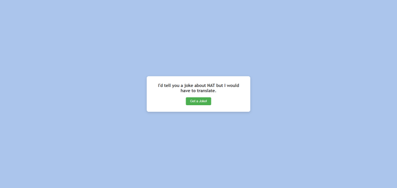

# Simple API 2 Project

This project fetches a joke from a jokes API and display that joke on the UI!

## How It's Made:

**Tech used:**: HTML, CSS, and JavaScript

I used html for the markup, css for the styling, andI used Javascript for the logic of this project.

## Lessons Learned:

I learned how to run javascript code in HTML strings, and turn the output into a number via the eval function. 

## Image of Project:

